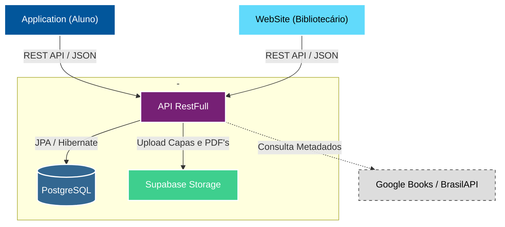

  <!-- Banner -->
  

  <!-- Pins dos Repositórios -->
  &nbsp;&nbsp;&nbsp;
  &nbsp;&nbsp;&nbsp;
  

 

  <h1>Sobre o Projeto</h1>

A **LumiLivre API** é o núcleo de processamento e inteligência de todo o ecossistema. Desenvolvida em **Java 17** com **Spring Boot 3**, ela centraliza a lógica de negócios, a persistência de dados e a segurança, servindo tanto o painel administrativo (Web) quanto o aplicativo dos alunos (Mobile).

Atualmente hospedada no **Render** via Docker, a API utiliza **PostgreSQL** (hospedado no Supabase) como banco de dados relacional, garantindo robustez e integridade para as operações da biblioteca.

A documentação interativa está disponível em: [api-lumilivre.com.br/swagger-ui](https://lumilivre-api.onrender.com/swagger-ui/index.html#/).

 

  <h1>Funcionalidades Principais</h1>

### 🧠 Regras de Negócio
- **Gestão de Empréstimos:** Controle rigoroso de prazos, renovações e cálculo automático de multas/penalidades baseadas em dias de atraso.
- **Controle de Estoque:** Gerenciamento de exemplares físicos, status de disponibilidade e baixa automática.
- **Validação de Usuários:** Lógica diferenciada para Administradores, Bibliotecários e Alunos.

### 🔌 Integrações Externas
- **Google Books & BrasilAPI:** Preenchimento automático de metadados de livros (sinopse, autor, capa) apenas informando o ISBN.
- **Supabase Storage:** Armazenamento em nuvem para capas de livros e arquivos PDF de TCCs.
- **Serviço de E-mail:** Notificações automáticas para empréstimos realizados, devoluções e redefinição de senha.

### 📊 Relatórios & Dados
- **Geração de PDF:** Engine interna (OpenPDF) para gerar relatórios detalhados de acervo e movimentações.
- **Dashboards:** Endpoints otimizados para fornecer estatísticas em tempo real para os clientes frontend.
- **Importação em Massa:** Processamento de arquivos Excel (.xlsx) para carga inicial de dados.

 

  <h1>Arquitetura do Sistema</h1>

Utilizamos uma arquitetura cliente-servidor moderna baseada em microsserviços e nuvem para garantir escalabilidade.

 

  <h1>Segurança</h1>

- **Spring Security & JWT:** Implementação robusta de autenticação e autorização `Stateless`.
- **Criptografia:** Senhas armazenadas com hash BCrypt.
- **CORS Config:** Política de acesso restrita aos domínios da aplicação Web e Mobile.

 

  LumiLivre © 2025 - Todos os direitos reservados.

