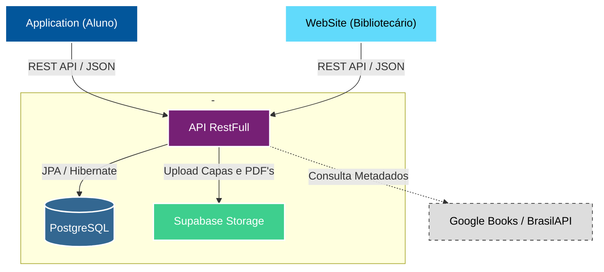

<div align="center">
  <!-- Banner -->
  <a href="https://n33miaz.github.io/n33miaz-links/#lumitcc"></a>

  <!-- Pins-->
  <a href="https://n33miaz.github.io/n33miaz-links/#lumiweb"></a>
  <a href="https://n33miaz.github.io/n33miaz-links/#lumiapp"></a>
  <a href="https://n33miaz.github.io/n33miaz-links/#lumiapi"></a>
</div>

<br/>

<div align="center">


[](https://lumilivre-api.onrender.com/docs)

</div>

<br/>

<div align="center">
  <h1>Sobre o Projeto</h1>
</div>

A **LumiLivre API** é o núcleo de processamento e inteligência de todo o ecossistema. Desenvolvida em **Java 17** com **Spring Boot 3**, ela centraliza a lógica de negócios, a persistência de dados e a segurança, servindo tanto o painel administrativo (Web) quanto o aplicativo dos alunos (Mobile).

Atualmente hospedada no **Render** via Docker, a API utiliza **PostgreSQL** (hospedado no Supabase) como banco de dados relacional, garantindo robustez e integridade para as operações da biblioteca.

A documentação interativa está disponível em: [lumilivre-api.onrender.com/docs](https://lumilivre-api.onrender.com/docs).

<br/>

<div align="center">
  <h1>Stack Técnica</h1>
</div>

| Camada | Tecnologia |
|--------|------------|
| Linguagem / Runtime | Java 17 (Eclipse Temurin) |
| Framework | Spring Boot 3.2.5 (Web MVC, Data JPA, Security, Cache, Mail, Actuator) |
| Persistência | PostgreSQL 16 (Supabase) + Hibernate + **Flyway** |
| Cache | **Redis** (Spring Data Redis) com fallback `ConcurrentMap` |
| Observabilidade | Logback JSON + Logstash encoder, **Micrometer + Prometheus**, correlationId via MDC |
| Resiliência | **Resilience4j** (retry + circuit-breaker + timeout + fallback) |
| Segurança | Spring Security, JWT (`jjwt`), BCrypt, **Bucket4j** (rate-limit) |
| Mensageria leve | **Outbox Pattern** com `@Scheduled` publisher |
| Docs | Springdoc OpenAPI 3 |
| Relatórios | OpenPDF |
| Importação | Apache POI 5.3 (XLSX) |
| Build | Maven Wrapper |
| Deploy | Dockerfile multi-stage + Render |

<br/>

<div align="center">
  <h1>Funcionalidades Principais</h1>
</div>

### 🧠 Regras de Negócio
- **Gestão de Empréstimos:** controle rigoroso de prazos, penalidades por faixa (0-1, 2-5, 6-7, 8-90, >90 dias) e **job noturno** que sincroniza `ATIVO → ATRASADO`.
- **Controle de Estoque:** exemplares físicos por tombo com status `DISPONIVEL/EMPRESTADO/INDISPONIVEL/EM_MANUTENCAO`.
- **Solicitações e Reservas FIFO:** aluno solicita pelo app, bibliotecário aprova no web; livros sem exemplar entram em fila de reserva.
- **Recomendações:** top livros por gênero favorito + fallback por avaliação, com cache por matrícula.
- **Trilha de auditoria admin:** todas as ações sobre alunos, livros, usuários e TCCs gravam `before/after` via aspect `@Auditable`.

### 🔌 Integrações Externas (resilientes)
- **Google Books & BrasilAPI** para metadados por ISBN.
- **Supabase Storage** para capas e PDFs.
- **SMTP Gmail** com publicação via **Outbox** — falha de email não reverte a transação de empréstimo.
- **ViaCEP** para preenchimento automático de endereço.

### 📊 Dashboards e Relatórios
- Views materializadas `mv_dashboard_stats`, `mv_top_livros`, `mv_emprestimos_por_mes` alimentando dashboard em <500ms.
- Geração de PDF (OpenPDF) para acervo, alunos, exemplares e empréstimos.
- Endpoints `/actuator/prometheus` com métricas de domínio (`loans.active`, `loans.overdue`, `requests.pending`, `returns.avg_days`).

### 🔐 Segurança (reforçada)
- **Allowlist explícita** no Spring Security — todo endpoint fora da lista é autenticado por padrão.
- **Ownership por aluno** via `@CanAccessStudent` + `StudentAuthorizationService` (mitiga IDOR).
- **Rate-limit** em `/auth/login` e `/auth/esqueci-senha` com Bucket4j.
- **CORS por ambiente** via `${LUMILIVRE_CORS_ORIGINS}`.
- **Segredos fora do repositório**: `application.properties` consome `${ENV}`; `application-example.properties` serve como template.

<br/>

<div align="center">
  <h1>Arquitetura do Sistema</h1>
</div>

Utilizamos uma arquitetura cliente-servidor moderna baseada em microsserviços e nuvem para garantir escalabilidade.



### Camadas internas

```
controller  →  service  →  domain/policy  →  repository  →  PostgreSQL
                                           ↘ infra (Google Books, BrasilAPI, ViaCEP, Supabase, SMTP)
                                           ↘ outbox (eventos assíncronos)
config · security (JWT, ownership, rate-limit, audit) · cache (Redis) · exception · dto
```

As **policies puras** em `api/domain/policy/` (LoanPolicy, PenaltyPolicy, BookAvailabilityPolicy, RequestApprovalPolicy, ReservationPolicy) não dependem de Spring e por isso são diretamente testáveis.

<br/>

<div align="center">
  <h1>Observabilidade</h1>
</div>

- **Logs JSON** em produção (`logback-spring.xml`) com `correlationId` propagado via filtro `CorrelationIdFilter`.
- **Actuator** expõe `/actuator/health`, `/actuator/info`, `/actuator/metrics`, `/actuator/prometheus`.
- **Métricas de negócio** via `BusinessMetricsService` (empréstimos ativos/atrasados, solicitações pendentes, tempo médio de devolução).
- **Trilha de auditoria** em `audit_log` para cada ação admin.

<br/>

<div align="center">
  <h1>Resiliência</h1>
</div>

- **Resilience4j** envolve Google Books, BrasilAPI e Supabase Storage com retry + circuit-breaker + timeout + fallback — uma instabilidade externa não derruba o cadastro.
- **Outbox Pattern** desacopla SMTP da transação principal: eventos `LoanCreated/Returned/RequestAccepted/Rejected` são persistidos e republicados pelo scheduler, com retry ≤ 3.
- **Job de atraso** e **job de notificação** (D-3, D-1, D0, atraso) rodam diariamente sem afetar o caminho síncrono do usuário.

<br/>

<div align="center">
  <h1>Como rodar localmente</h1>
</div>

O `application.properties` usa variáveis de ambiente (`${LUMILIVRE_*}`) para manter segredos fora do repositório. Se alguma variável obrigatória faltar, o Spring falha na inicialização antes de subir a API.

Variáveis obrigatórias:

- `LUMILIVRE_DB_URL` (JDBC, Session pooler do Supabase em `:5432`, com `sslmode=require`)
- `LUMILIVRE_DB_USER` (formato `postgres.<project-ref>`)
- `LUMILIVRE_DB_PASSWORD`
- `LUMILIVRE_JWT_SECRET` (≥ 64 caracteres aleatórios)
- `LUMILIVRE_MAIL_USERNAME`
- `LUMILIVRE_MAIL_PASSWORD`
- `LUMILIVRE_SUPABASE_URL`
- `LUMILIVRE_SUPABASE_KEY` (publishable / anon — exposição pública controlada)
- `LUMILIVRE_SUPABASE_SERVICE_ROLE_KEY` (JWT `service_role` — **backend apenas**; bypassa RLS)

### Git Bash

```bash
# 1. Configure as variáveis locais
cp .env.example .env

# Edite o .env e substitua todos os placeholders.
# Depois carregue as variáveis na sessão atual:
set -a
source .env
set +a

# 2. Execute
./mvnw clean install
./mvnw spring-boot:run

# 3. Testes
./mvnw test
```

### PowerShell

```powershell
# 1. Configure as variáveis locais na sessão atual
$env:LUMILIVRE_DB_URL = "jdbc:postgresql://<host>:5432/postgres"
$env:LUMILIVRE_DB_USER = "<postgres-user>"
$env:LUMILIVRE_DB_PASSWORD = "<postgres-password>"
$env:LUMILIVRE_JWT_SECRET = "<random-64-plus-character-jwt-secret>"
$env:LUMILIVRE_MAIL_USERNAME = "<smtp-user>"
$env:LUMILIVRE_MAIL_PASSWORD = "<smtp-password>"
$env:LUMILIVRE_SUPABASE_URL = "https://<project-ref>.supabase.co"
$env:LUMILIVRE_SUPABASE_KEY = "<supabase-key>"
$env:LUMILIVRE_CORS_ORIGINS = "http://localhost:5173,http://localhost:8080"

# Opcional para banco dev vazio: Flyway cria o schema antes do Hibernate validar.
$env:LUMILIVRE_FLYWAY_ENABLED = "true"

# Opcional para popular dados demo sinteticos.
$env:LUMILIVRE_FLYWAY_LOCATIONS = "classpath:db/migration,classpath:db/seed,classpath:db/vendor/postgresql"

# 2. Execute
.\mvnw.cmd clean install
.\mvnw.cmd spring-boot:run

# 3. Testes
.\mvnw.cmd test

# 4. Container, usando um .env real
docker build -t lumilivre-api .
docker run -p 8080:8080 --env-file .env lumilivre-api
```

As mensagens `Spring Data Redis - Could not safely identify store assignment` podem aparecer quando JPA e Redis estão no classpath. Elas são informativas; o erro fatal é o primeiro `Caused by` apontando uma variável obrigatória ausente.

### Banco de dados e migrations

Toda alteração de schema passa por **Flyway** em `src/main/resources/db/migration/V<seq>__<desc>.sql`.
O `ddl-auto` deve permanecer em `validate`: para criar tabelas em banco vazio, habilite Flyway com `LUMILIVRE_FLYWAY_ENABLED=true`. Dados demo ficam fora do caminho padrão e só entram quando `classpath:db/seed` for incluído em `LUMILIVRE_FLYWAY_LOCATIONS`.

<br/>

<div align="center">
  <h1>Testes</h1>
</div>

- Unitários: JUnit 5 + AssertJ para policies puras.
- Integração: Spring Boot Test + Testcontainers PostgreSQL (roadmap em `execution_plan_v2.md`).
- Workflow CI em `.github/workflows/api.yml` executa `mvn test` + `mvn package`.

<br/>

<div align="center">
  <h1>Licença</h1>
</div>

Distribuído sob a licença **MIT**. Veja `LICENSE` para mais detalhes.

<br/>

<div align="center">
  <sub>LumiLivre © 2025 - Todos os direitos reservados.</sub>
</div>
