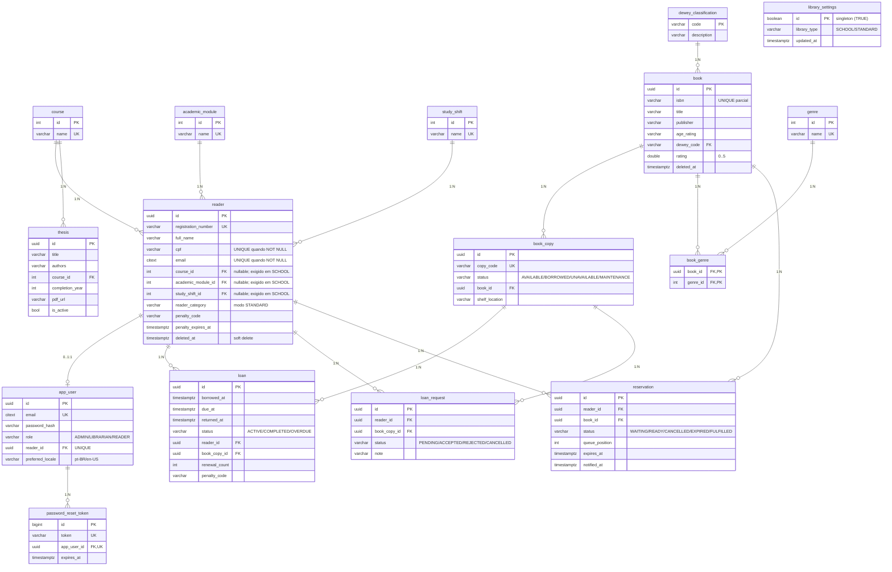
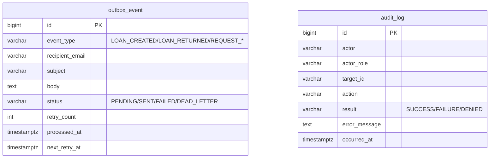
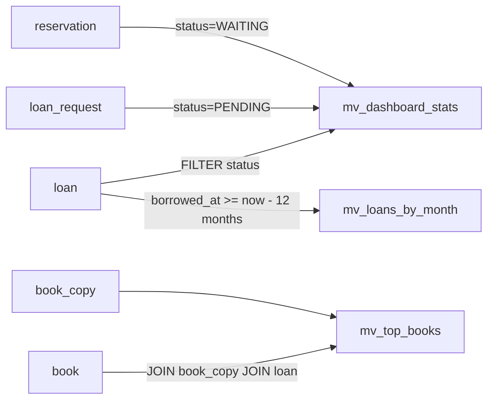

# Diagrama Entidade-Relacionamento — LumiLivre

> Versão: 2026-07-01 — Baseline V1..V7 + materialized views V3.
> Fonte de verdade: migrations Flyway em `src/main/resources/db/migration/`.

## Visão geral

O schema cobre três núcleos de negócio:

1. **Acervo** — `book`, `book_copy`, `book_genre`, `dewey_classification`, `genre`.
2. **Pessoas & autenticação** — `reader`, `app_user`, `password_reset_token`,
   `course`, `academic_module`, `study_shift`.
3. **Operações** — `loan`, `loan_request`, `reservation`, `thesis`,
   `outbox_event`, `audit_log`.

Além deles, `library_settings` (single-row) guarda a configuração global do
tipo de biblioteca (`SCHOOL`/`STANDARD`), que condiciona a obrigatoriedade dos
campos acadêmicos do `reader`.

Tabelas de referência (`course`, `academic_module`, `study_shift`, `genre`,
`dewey_classification`) usam `INTEGER GENERATED BY DEFAULT AS IDENTITY` ou
chave natural (CDD); demais entidades de domínio usam `UUID` com
`gen_random_uuid()` (extensão `pgcrypto`).

## Diagrama principal

## Infraestrutura assíncrona

Sem chave estrangeira para o domínio: `outbox_event` e `audit_log` são tabelas
append-only de infraestrutura (`BIGINT IDENTITY`, ADR-001).

## Views materializadas (V3)

- `mv_dashboard_stats` — 1 linha com contadores agregados (`UNIQUE INDEX
  ((1))` mas refresh **não-concurrent** por limitação da expressão).
- `mv_top_books` — top 20 livros mais emprestados.
- `mv_loans_by_month` — volume mensal dos últimos 12 meses.

Refresh: `DashboardService.refreshViews()` a cada 15 minutos quando o JDBC
estiver em PostgreSQL (caso contrário, no-op — útil para suíte H2 de testes).

## Convenções

- **Soft delete** via `deleted_at TIMESTAMPTZ` em `reader`, `book`,
  `book_copy`, `thesis`, `app_user`. Índices `UNIQUE` partial usam
  `WHERE ... AND deleted_at IS NULL`.
- **Auditoria temporal** via `created_at`/`updated_at TIMESTAMPTZ NOT NULL
  DEFAULT now()` + trigger `touch_updated_at` em todas as tabelas mutáveis.
- **Email case-insensitive** via extensão `citext` (`reader.email`,
  `app_user.email`).
- **Locale por usuário** via `app_user.preferred_locale` (`pt-BR` por padrão);
  consumido pelo `MessageResolver` para resolver textos de e-mail.
- **Row Level Security deny-by-default** habilitado em todas as tabelas
  (`ALTER TABLE ... ENABLE ROW LEVEL SECURITY` + `FORCE`). Backend conecta
  como owner; PostgREST / Supabase Data API ficam bloqueadas.

## Referências cruzadas

- DDL completo: [`ddl_standalone.sql`](./ddl_standalone.sql)
- Dicionário: [`data_dictionary.md`](./data_dictionary.md)
- Migração legado→LumiLivre: [`migration_from_legacy.md`](./migration_from_legacy.md)
- Portabilidade para outros bancos: [`portability_notes.md`](./portability_notes.md)
- ADRs relevantes: ADR-001 (chaves), ADR-004 (Supabase pooler), ADR-005 (RLS),
